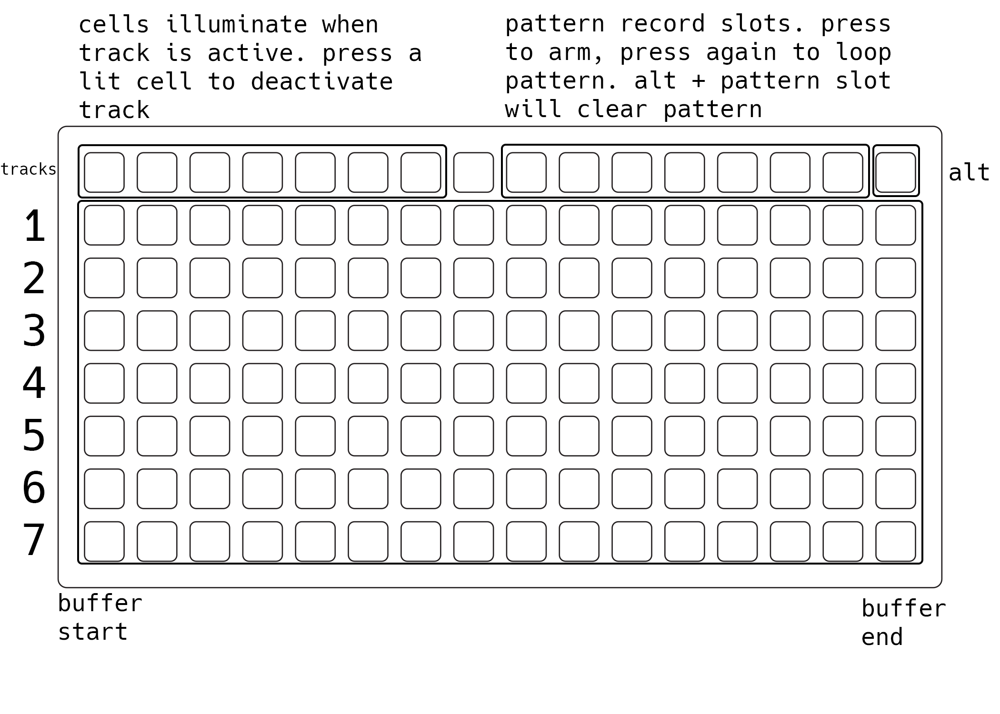

# mangl v1.6

### arc required.

---

based on angl
by @tehn and the
engine/script, glut by @artfwo

---

load samples via param menu.

---

mangl is a 7 track granular
sample player.

* arc ring 1 = speed
* arc ring 2 = pitch
* arc ring 3 = grain size
* arc ring 4 = density

* norns key1 = alt
* norns key2 = enable/disable
               voice
* norns enc1 = track volume
* norns enc3 = nav

holding alt and turning a ring,
or pressing a button,
performs a secondary
function.

* alt + ring1 = scrub
* alt + ring2 = fine tune
* alt + ring3 = spread
* alt + ring4 = jitter

* alt + key2 = loop in/out
* alt + key3 = loop clear

_nb: loop in/out is set in
one button press. loop in
on press, loop out on release._

## grid

---

@justmat

llllllll.co/t/21066
